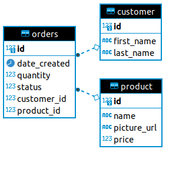

# Store app 

Esta é uma aplicação simples que simula uma pequena loja, com gerenciamento de clientes, produtos e pedidos.
A documentação pode ser acessada através através do seguinte link [Documentação da API](http://localhost:8080/swagger-ui/index.html?configUrl=/v3/api-docs/swagger-config#/).

Obs: Para acessar a documentação é necessário que a aplicação esteja executando. O link acima abrirá a documentação 
embedded do swagger, é necessário alterar o arquivo na barra de busca para o seguinte path `/v2/api-docs`, 
infelizmente não consegui identificar qual foi o problema antes do fim do prazo.

Abaixo é possível ver um diagrama mostrando a modelagem usada.




Essa aplicação está adaptada para executar de 3 formas:
- Standalone
- Docker
- Kubernetes

A maioria dos comandos para executar a aplicação devem ser usados no diretório raiz
com exceção dos arquivos de configuração do kubernetes.

### Standalone
```
mvn spring-boot:run
```


### Docker
Criação da imagem e execução do container.
```
docker build -t api-store-app .

docker run --name api-store-app -p 8080:8080 api-store-app 

```


### Kubernetes

Essa forma de instalação foi feita pensando na utilização do `minikube` por ser de
mais fácil utilização.

O primeiro comando é usado para fazer o construir a imagem docker dentro do ambiente (docker daemon) do minikube.
O segundo comando é usado para fazer o deploy dos arquivos de configurações:
- deployment
- service
- namespace

```
./deploy.sh

cd kubernetes

./kubectl-apply -f
```

Para acessar a aplicação basta executar o seguinte comando `minikube service --url store-service -n api-store`.
Sua saída deve ser algo como `http://192.168.49.2:30001`.

Para checar se a execução está funcionando corretamente, basta acessar o dashboard de administração do kubernetes
`minikube dashboard` e alterar o namespace para `api-store`.


### Execução
Após a execução da aplicação é possível inserir alguns dados usando o script `db-init.sh`, 
esse script vai fazer algumas requisições para o backend.

Obs: O script aponta para `localhost:8080` se a API estiver executando em algum 
outro endereço ou porta, é necessário alterá-la no script.


Para executar os testes unitários desenvolvidos basta usar o seguinte comando: `mvn test`